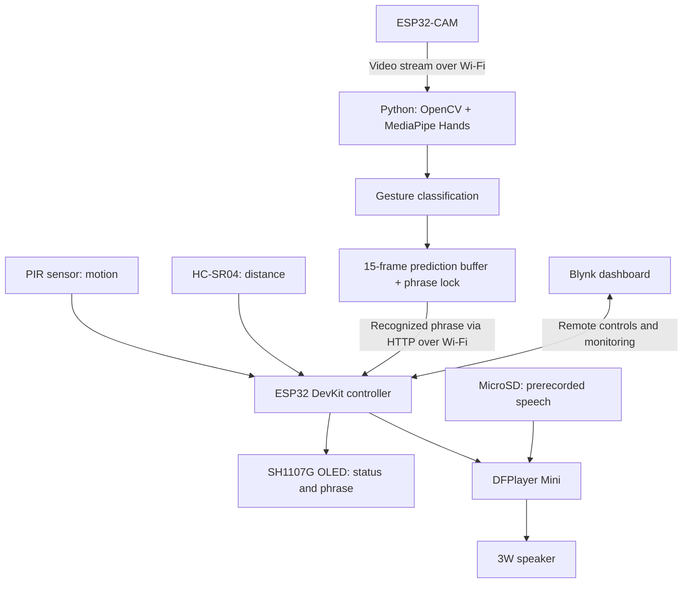

# SwiftSign

### A classroom communication assistant using hand gestures, computer vision, and IoT

SwiftSign helps students with hearing impairments communicate common classroom needs through predefined hand gestures. An ESP32-CAM streams video to a Python application, which recognizes a gesture and sends its corresponding phrase to an ESP32 controller. The controller displays the phrase on an OLED screen and plays prerecorded speech through a speaker.

The prototype combines **eight classroom phrases**, **presence and distance sensing**, and **Blynk remote controls** in an affordable assistive communication system.

**Scope:** SwiftSign recognizes a custom, predefined gesture vocabulary. The current prototype is not a general-purpose ASL or TSL translator, and gesture recognition requires a laptop running Python.

[Watch the demo](https://youtu.be/eCV0WLtpLGA)

## Contents

- [Features](#features)
- [Architecture and workflow](#architecture-and-workflow)
- [Hardware](#hardware)
- [Software and tech stack](#software-and-tech-stack)
- [Repository structure](#repository-structure)
- [How the system works](#how-the-system-works)
- [Gesture vocabulary](#gesture-vocabulary)
- [Hardware connections](#hardware-connections)
- [Implementation details](#implementation-details)
- [Blynk controls and monitoring](#blynk-controls-and-monitoring)
- [Setup overview](#setup-overview)
- [Results](#results)
- [Challenges and solutions](#challenges-and-solutions)
- [Limitations](#limitations)
- [Future improvements](#future-improvements)
- [Demo video](#demo-video)
- [Authors](#authors)

## Features

- **Gesture-to-phrase communication:** Recognizes eight predefined gestures for everyday classroom interactions.
- **Text and speech output:** Displays recognized phrases on a 1.5-inch SH1107G OLED and plays matching audio through a DFPlayer Mini and 3W speaker.
- **User detection:** Uses a PIR sensor to detect movement near the device.
- **Distance guidance:** Uses an HC-SR04 ultrasonic sensor to determine whether the user is within the 50 cm operating range.
- **Stable phrase selection:** Uses recent predictions across 15 frames to confirm a gesture.
- **Repeat prevention:** Locks the recognized phrase until the user performs a closed-fist reset.
- **Remote control:** Supports device on/off, male/female voice selection, and audio enable/disable through Blynk.
- **Wireless integration:** Connects the camera, Python recognition application, and controller over Wi-Fi.

## Architecture and workflow

The system separates video capture, gesture recognition, and physical outputs across three components:

| Component | Responsibility |
| --- | --- |
| ESP32-CAM | Captures hand gestures and streams video over Wi-Fi. |
| Laptop running Python | Processes the stream, tracks hand landmarks, classifies gestures, confirms predictions, and sends recognized phrases through HTTP. |
| ESP32 DevKit | Reads sensors, provides status messages, receives phrase data, controls the OLED and audio output, and communicates with Blynk. |



The ESP32-CAM provides the video feed; recognition takes place in the Python application. Speech output uses stored recordings rather than a text-to-speech engine.

## Hardware

| Component | Quantity | Purpose |
| --- | --- | --- |
| ESP32 DevKit | 1 | Main controller for sensors, communication, display, and audio. |
| ESP32-CAM | 1 | Captures and streams gesture video. |
| PIR sensor | 1 | Detects user movement. |
| HC-SR04 ultrasonic sensor | 1 | Measures the distance between the user and device. |
| 1.5-inch SH1107G OLED display | 1 | Shows system status and recognized phrases. |
| DFPlayer Mini | 1 | Plays prerecorded phrase audio. |
| 3W speaker | 1 | Outputs speech. |
| MicroSD card | 1 | Stores audio for the DFPlayer Mini. |
| Breadboard | 1 | Supports circuit prototyping. |
| Jumper wires | Multiple | Connects components. |
| USB cables | 2 | Uploads firmware and supplies power to the ESP32 boards. |

A laptop is also required to run the Python recognition application.

## Software and tech stack

| Technology | Role |
| --- | --- |
| Arduino IDE and C++ | Develops and uploads firmware for both ESP32 boards. |
| Python | Implements gesture recognition and phrase handling. |
| OpenCV (`cv2`) | Processes video frames and displays the recognition interface. |
| MediaPipe Hands (`mediapipe`) | Detects and tracks 21 hand landmarks. |
| `requests` | Sends recognized phrases to the controller using HTTP requests. |
| `collections` | Stores recent predictions for gesture confirmation. |
| `time` | Provides timing and delay functions. |
| `json` | Loads the phrase database. |
| `pathlib` | Handles paths and access to the phrase database. |
| Blynk | Provides remote monitoring and system controls. |

### ESP32 firmware libraries

| Library | Used by | Purpose |
| --- | --- | --- |
| `WiFi.h` | Both boards | Wi-Fi connectivity. |
| `esp_camera.h` | ESP32-CAM | Camera control and frame capture. |
| `esp_http_server.h` | ESP32-CAM | Video streaming server. |
| `WebServer.h` | Controller | HTTP endpoints for the Python application. |
| `BlynkSimpleEsp32.h` | Controller | Blynk connection and remote controls. |
| `Wire.h` | Controller | I2C communication with the OLED. |
| `Adafruit_GFX.h` | Controller | Graphics and text rendering. |
| `Adafruit_SH110X.h` | Controller | SH1107 OLED control. |
| `DFRobotDFPlayerMini.h` | Controller | Audio playback control. |

## Repository structure

The report documents the following project layout:

```text
SWIFTSIGN/
├── Arduino/
│   ├── ESP32CAM_Stream/
│   │   └── ESP32CAM_Stream.ino
│   └── SwiftSign_Controller/
│       └── SwiftSign_Controller.ino
├── Python/
│   ├── vocabulary/
│   │   └── phrase_database.json
│   ├── config.py
│   ├── gesture_recognition.py
│   ├── phrase_mapper.py
│   └── requirements.txt
├── README.md
└── Start_SwiftSign.bat
```

This layout is transcribed from the report; the source files and launch script were not supplied with it for verification.

## How the system works

1. **Detect a user.** The PIR sensor sends a HIGH signal to the controller when it detects movement.
2. **Check distance.** The controller reads the HC-SR04. Within 50 cm, the OLED prompts **“Show gesture”**; otherwise, it prompts **“Move closer.”** The display also supports a **“Waiting”** status.
3. **Capture and process video.** The ESP32-CAM continuously streams frames over Wi-Fi to the laptop. OpenCV processes the feed, and MediaPipe Hands identifies hand landmarks.
4. **Classify the gesture.** The Python application uses the landmark positions to determine which fingers are extended and identify a supported hand sign.
5. **Confirm the phrase.** Recent predictions are buffered across 15 frames. The most frequently detected sign is selected to reduce unstable frame-by-frame output.
6. **Display and speak.** Python sends the recognized phrase to the controller through HTTP. The OLED displays the phrase, and the DFPlayer Mini plays its associated recording when audio is enabled.
7. **Hold the result.** The phrase locks after recognition, preventing the same held gesture from repeatedly triggering output.
8. **Reset for another phrase.** A closed fist unlocks the phrase hold so the user can make another selection.

## Gesture vocabulary

These are the prototype's custom gesture mappings.

| Hand gesture | Phrase or action |
| --- | --- |
| Open palm with fingers spread | Hello |
| Open palm with fingers together | Goodbye |
| Thumbs up | Yes |
| Thumbs down | No |
| Index finger extended | I have a question |
| Peace sign: index and middle fingers extended | I need help |
| Index, middle, and ring fingers extended | May I go to the restroom? |
| Pinky and thumb extended | Thank you |
| Closed fist | Reset: unlocks phrase hold without producing a new OLED phrase output. |

The reset gesture is a control action, separate from the eight communication phrases.

## Hardware connections

The connections below reproduce the report's wiring table. GPIO numbers refer to the ESP32 controller unless otherwise stated; RX and TX labels in the DFPlayer row refer to the DFPlayer module.

| Component | Supply | Ground | Signal connections |
| --- | --- | --- | --- |
| PIR sensor | 3.3V | GND | Signal → GPIO 27 |
| HC-SR04 | 5V | GND | TRIG → GPIO 5; ECHO → GPIO 18 |
| SH1107G OLED | 3.3V | GND | SDA → GPIO 21; SCL → GPIO 22 |
| DFPlayer Mini | 5V | GND | RX → GPIO 16; TX → GPIO 17 |
| Speaker | — | — | DFPlayer SPK1 and SPK2 |
| ESP32-CAM | 5V | GND | Wi-Fi communication |
| MicroSD card | — | — | Inserted into the DFPlayer Mini |

The report does not provide a complete electrical schematic or the full firmware UART configuration. Treat this as documentation of the reported prototype connections, and verify those details against the actual hardware and firmware before assembly.

## Implementation details

### Presence and distance sensing

The PIR sensor on GPIO 27 detects changes in infrared radiation caused by movement. The HC-SR04 uses GPIO 5 for its trigger and GPIO 18 for its echo signal.

Distance is calculated as:

```text
Distance (cm) = (Echo duration in microseconds × 0.034) / 2
```

The factor `0.034` is the approximate speed of sound in centimeters per microsecond. Dividing by two accounts for the outgoing and returning sound pulse. The measured distance determines whether the user is within the 50 cm interaction range.

### Camera and recognition pipeline

The ESP32-CAM firmware establishes Wi-Fi connectivity and serves a continuous video stream. The Python application processes that stream with OpenCV and MediaPipe Hands, using **21 landmarks** to distinguish finger configurations.

The implementation combines landmark-based gesture classification with a recent-prediction buffer and a phrase lock. These mechanisms address two separate problems: inconsistent gesture predictions and repeated playback while a gesture remains visible.

### Phrase delivery and outputs

The controller runs an HTTP server to receive recognized phrase data from Python. It updates the OLED and triggers the corresponding prerecorded audio through the DFPlayer Mini. The MicroSD card stores the audio recordings, and Blynk controls the selected voice mode and whether audio is enabled.

The report includes a phrase-display routine that clears the OLED, draws a face, and renders the message. Messages longer than 18 characters are split into two displayed segments, with the shown routine using up to 36 characters.

## Blynk controls and monitoring

### Controls

| Control | Behavior |
| --- | --- |
| Device Power | Turns the system's operating state on or off. |
| Voice Mode | Switches between male and female voice modes. |
| Audio Mode | Enables or disables speech playback; OLED text remains available when audio is disabled. |

### Monitoring

The dashboard shown in the report includes **Recognized Phrase**, **System Status**, **Motion Detected**, **Confidence**, and **Distance** indicators.

The report does not specify Blynk virtual-pin assignments, datastream configuration, or how the displayed confidence value is calculated. The confidence display should not be interpreted as a measured overall recognition accuracy.

## Setup overview

The report describes the system components and project layout but does not include a complete reproducible installation guide. The following sequence summarizes the documented integration:

1. Assemble the controller, sensors, OLED, DFPlayer Mini, speaker, and ESP32-CAM using the reported connections, after verifying the hardware and firmware details.
2. Prepare the MicroSD card with the prerecorded phrase audio required by the controller's phrase and voice mappings.
3. Install the required ESP32 firmware libraries in the Arduino development environment, then upload the camera and controller sketches to their respective boards.
4. Prepare the laptop's Python environment with the recognition dependencies listed above and the project's phrase database.
5. Configure Wi-Fi communication, the camera stream connection, and the controller connection in the actual project files.
6. Configure Blynk controls and monitoring to match the controller firmware.
7. Run the Python recognition application, move within the operating range, and test a gesture followed by the closed-fist reset.

Exact package versions, HTTP endpoint paths and payloads, stream URLs, audio filenames, and launch-script behavior are not specified in the report and must be taken from the source project.

**Credentials:** Supply your own Wi-Fi and Blynk credentials in your local configuration and keep them out of version control. No authentication tokens or credential-bearing screenshots from the report are included here.

## Results

The report describes successful prototype testing of the following functions:

- Detecting user movement and checking the operating distance.
- Recognizing the eight predefined classroom gestures.
- Displaying recognized phrases on the OLED and playing corresponding speech.
- Controlling the system state, male/female voice mode, and audio playback through Blynk.
- Keeping text output available while audio playback is disabled.

The demo presents an example conversation using **five of the supported phrases**, along with system states and voice switching.

These are qualitative prototype results. The report does not provide a test-set size, aggregate recognition accuracy, latency measurements, or a formal classroom user evaluation.

## Challenges and solutions

| Challenge | Solution documented in the report |
| --- | --- |
| Intermittent Wi-Fi communication between the ESP32-CAM, Python application, and controller | Repeated communication testing and debugging until stable connections were maintained. |
| Audio failing to play after successful recognition | Reorganized audio files and revised communication logic between the controller and DFPlayer Mini. |
| Similar finger combinations being mistaken for other phrases | Redesigned several gestures to make them more distinct and added a prediction buffer. |
| Continuous repetition while a user held a gesture | Added a phrase lock released by a closed-fist reset. |

## Limitations

- **Restricted vocabulary:** Supports eight predefined phrases rather than open-ended communication.
- **Custom gestures:** Does not yet recognize a full sign language such as ASL or TSL.
- **Laptop dependency:** The recognition application runs externally in Python.
- **Recognition ambiguity:** Similar landmark patterns can cause inconsistent predictions; gesture redesign and buffering improve reliability but do not establish perfect recognition.
- **Network dependency:** The video and phrase-delivery pipeline relies on Wi-Fi communication between its components.
- **Limited evaluation evidence:** Performance is demonstrated qualitatively rather than through a reported benchmark.

## Future improvements

The report proposes three directions:

1. **Expand toward ASL or TSL recognition** beyond the current predefined phrase set.
2. **Collect additional hand-sign data and train machine-learning models** to recognize more complex hand patterns and movements.
3. **Move gesture recognition to a Raspberry Pi** to remove the laptop requirement and make the system smaller and easier to deploy.

## Demo video

**[Watch SwiftSign in action on YouTube](https://youtu.be/eCV0WLtpLGA)**

The demonstration shows an example conversation using five integrated phrases, several system states, and the voice-changing function.

## Authors

- **Raneen Yusoh**
- **Tunchanoke Kongpon**
- **Chonlada Saetang**

Developed for **ITE233 - Introduction to Internet of Things**, Information Technology, **Stamford International University**.

**Lecturers:** Aj. Zakariyya Bature and Aj. Atikom Srivallop  
**Report date:** June 23, 2026
